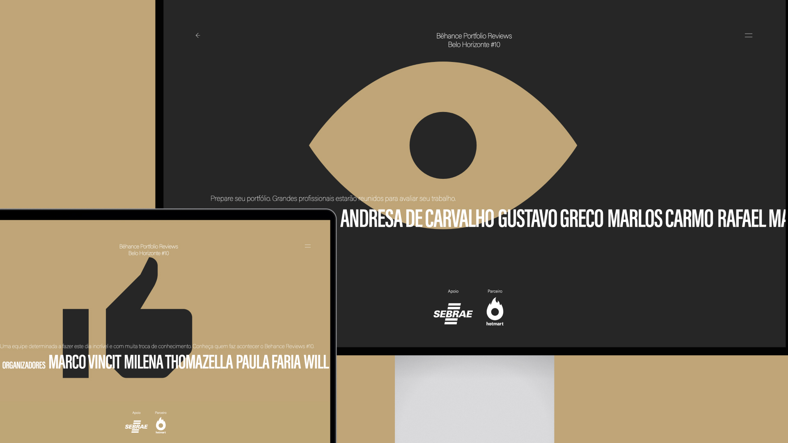

# 10th Bēhance   Portfolio Reviews   Belo Horizonte

### Shape Your Creative Portfolio with Expert & Peer Feedback
Our goal is promote the meeting of creative people, share their work and receive constructive feedback from huge professionals in Minas Gerais.

Behance Reviews is part of the official Behance calendar, associated with Adobe. The most important condition to do the official event in BH is that it is completely free for participants and fully collaborative.

Every year we are looking for partners, who believe in changing the cultural moviment of the city and identifying new talents.
